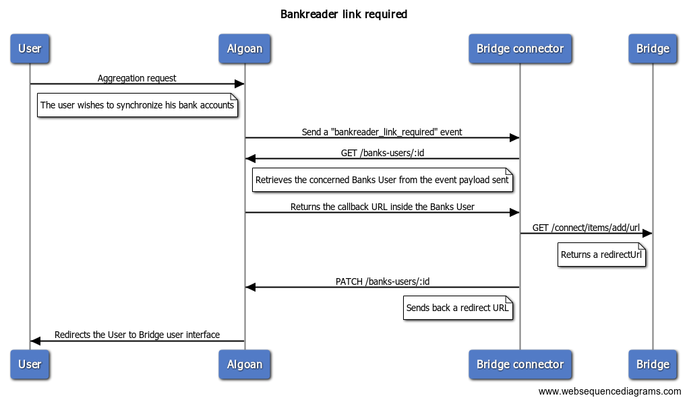
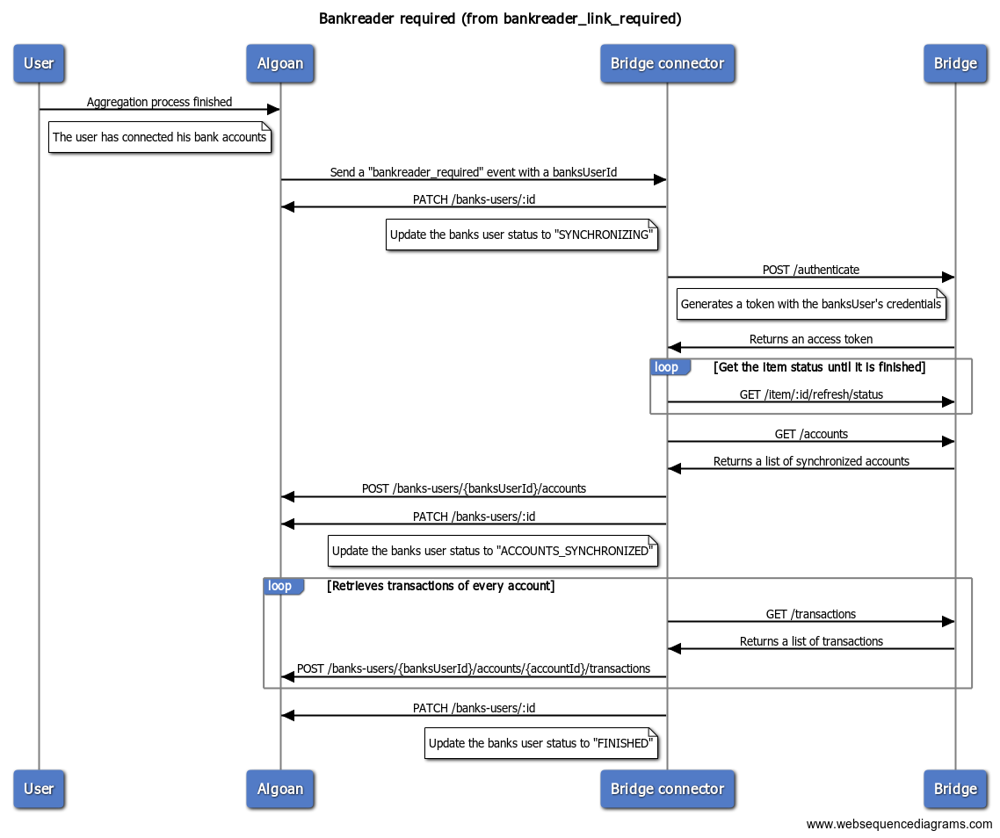
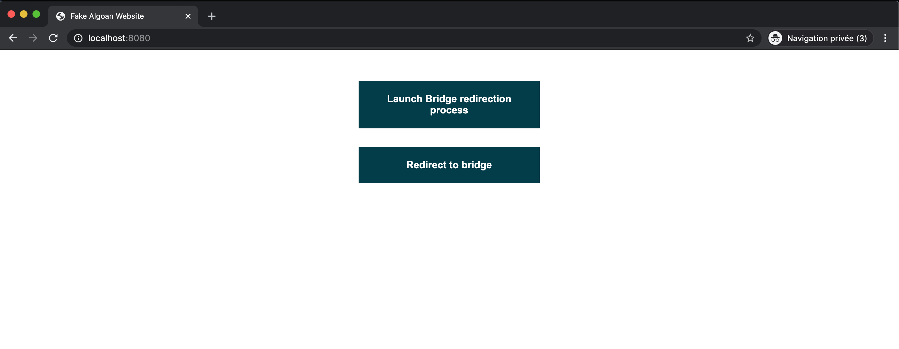

<p align="center">
  <a href="https://www.algoan.com/" target="blank"></a>
</p>

# Algoan NestJS Bridge connector

A simple connector using [NestJS](https://github.com/nestjs/nest) framework to connect your service to [Bridge](https://bridgeapi.io/).

## Table of contents

- [About Algoan and Bridge](#about-algoan-and-bridge)
- [Goal and Philosophy](#goal-and-philosophy)
- [Listened Subscriptions](#listened-subscriptions)
  - [Bankreader Link Required](#bankreader-link-required)
  - [Bankreader required](#bankreader-required)
- [Application Structure](#application-structure)
- [Usage](#usage)
  - [Requirements](#requirements)
  - [Installation](#installation)
  - [Running the app](#running-the-app)
  - [Test](#test)
  - [How to test locally](#how-to-test-locally)
  - [How to configure](#how-to-configure)
  - [Using Docker](#using-docker)
- [Contributing](#contributing)
  - [Instructions](#instructions)
  - [Code Style](#code-style)
- [Support](#support)

## About Algoan and Bridge

- [Algoan](https://www.algoan.com) helps companies to build the best open banking experience for credits. To see our products, please refer to our [official website](https://www.algoan.com)
- [Bridge](https://bridgeapi.io/) is a French banking data aggregator for financial services.

## Goal and Philosophy

A [connector](https://developers.algoan.com/public/docs/algoan_documentation/chatbot_and_services/connectors.html) is a web software able to connect a provider to Algoan's API. It subscribes to [REST Hooks](https://developers.algoan.com/public/docs/algoan_documentation/resthooks_and_events/resthooks.html) which lets Algoan notifying the connector when a specific [event](https://developers.algoan.com/public/docs/algoan_documentation/resthooks_and_events/resthooks.html#resthook-events) happens.

More information on the [official documentation](https://developers.algoan.com).

The **`nestjs-bridge-connector`** focuses on a user bank accounts and transactions. The main goal of this connector is to be able to retrieve a user bank data when Algoan wishes to.

## Listened Subscriptions

This section describes the process required for each subscription for a [Bank reader](https://developers.algoan.com/public/docs/algoan_documentation/resthooks_and_events/event_list.html#bank-reader) connector.

### Bankreader Link Required

The Bridge user needs to be redirected to an external page. The diagram below describes interactions:



Refers to the [`bankreader_link_required`](https://developers.algoan.com/public/docs/algoan_documentation/resthooks_and_events/event_list.html#bankreader_link_required) event.


### Bankreader required

When the user has finished the aggregation process, the connector has to retrieve user's banks accounts and transactions.

Refers to the [`bankreader_required`](https://developers.algoan.com/public/docs/algoan_documentation/resthooks_and_events/event_list.html#bankreader_required) event.

#### Redirection to Bridge user interface




## Application Structure

- `config/`: stores all configurations for the application. It uses [node-config-ts](https://github.com/tusharmath/node-config-ts) to generate a type definition of the `default.json` file.
- `src/algoan/`: Algoan module getting your service accounts. It uses the [@algoan/rest](https://github.com/algoan/rest-nodejs) library.
- `src/hooks/`: Entry point for your [RestHook](https://developers.algoan.com/public/docs/algoan_documentation/resthooks_and_events/resthooks.html) called by Algoan. It handles [events](https://developers.algoan.com/public/docs/algoan_documentation/resthooks_and_events/event_list.html) you've subscribed to.
- `src/aggregator`: contains all API calls to Bridge. It also handles the mapping between Bridge and Algoan.
- `test/`: contains e2e tests.

## Usage

How to use locally this connector.

### Requirements

This connector is a [Node.js](https://nodejs.org/en/) application available on [Docker Hub](#using-docker). Before reading further, you need to [download and install Node.js](https://nodejs.org/en/download/).

### Installation

Clone the repository:

```bash
$ git clone https://github.com/algoan/nestjs-bridge-connector.git --depth=1
```

Install all dependencies running:

```bash
$ npm install
```

### Running the app

```bash
# development
$ npm run start

# watch mode
$ npm run start:dev

# production mode
$ npm run start:prod
```

### Test

```bash
# unit tests
$ npm run test

# e2e tests
$ npm run test:e2e

# test coverage
$ npm run test:cov
```

### How to test locally

To test locally the Bridge process, a simple `index.html` file is rendered. To use it:

- Create a `config/user/{process.env.USER}.json` file to override app configurations. _NOTE_: This application uses [node-config-ts](https://github.com/tusharmath/node-config-ts). See the [How to configure](#how-to-configure) section for further information.
- Run `npm start`
- Go to your favorite browser and navigate to http://localhost:8080. It should display a web page: 



- Click on the first button "Launch Bridge redirection process". It will create a new Banks User and triggers the hooks controller.
- To be redirected to Bridge, click on the second button "Redirect to Bridge" . This will get your banks-user and redirect you to the Bridge redirect URL. If an alert appears, it means that the BanksUser has not been updated.

### How to configure

To configure your application properly, here is a list of key to set:

| Property name | Mandatory | Type | Description |
|-|-|-|-|
| `algoan` | Yes | _object_ | Algoan base configurations to retrieve service accounts |
| `algoan.baseUrl` | Yes | _string_ | Algoan host URL |
| `algoan.clientId` | Yes | _string_ | OAuth2 Client ID provided by Algoan |
| `algoan.clientSecret` | Yes | _string_ | OAuth2 Client Secret provided by Algoan |
| `bridge` | No | _object_| Bridge credentials if it is not set in your service account |
| `bridge.baseUrl` | No | _string_ | Bridge sandbox URL |
| `bridge.clientId` | No | _string_ | Bridge Client ID for the sandbox |
| `bridge.clientSecret` | No | _string_ | Bridge Client secret for the sandbox |
| `bridge.bankinVersion` | No | _string_ | Bankin version |
| `bridge.synchronizationTimeout` | No | _number_ | Timeout in seconds after each the synchronization trial is cancelled |
| `bridge.synchronizationWaitingTime` | No | _number_ | Time in seconds to wait between each call to get items |
| `targetUrl` | No | _string_ | Target URL for your resthook. See [the documentation](https://developers.algoan.com/public/docs/algoan_documentation/resthooks_and_events/resthooks.html#managing-your-resthook) for more information |
| `eventList` | No | _array<string>_ | Event List you want to subscribe to |
| `restHooksSecret` | No | _string_ | Resthooks secrets ensuring that all calls are made by Algoan. See [the documentation](https://developers.algoan.com/public/docs/algoan_documentation/resthooks_and_events/resthooks.html#validating-resthook-events) for more information |
| `port` | No | _number_ | Application networking port |

_NOTE_: Default values are defined in the [`config/default.json`](./config/default.json) file.

### Using Docker

If you use a Docker environment, you can pull the latest version of the connector on [Algoan's docker hub registry](https://hub.docker.com/u/algoan).

```bash
$ docker pull algoan/nestjs-bridge-connector
```

Then run the application:

```bash
$ docker run -p 8080:8080 algoan/nestjs-bridge-connector
```

As the docker image uses a production `NODE_ENV` and the [node-config-ts](https://github.com/tusharmath/node-config-ts) library, you need to create a `config/deployment/production.secret.json` file with your configurations or use environment variables:

| Variable | Description |
|-|-|
| `ALGOAN_BASE_URL` | Algoan host to retrieve service accounts |
| `ALGOAN_CLIENT_ID` | Client ID used to connect to Algoan |
| `ALGOAN_CLIENT_SECRET` | Client Secret used to connect to Algoan |

_Example_:

```bash
$ docker run -p 8080:8080 -e ALGOAN_BASE_URL=https://api.preprod.algoan.com \ 
  -e ALGOAN_CLIENT_ID=test \
  -e ALGOAN_CLIENT_SECRET=password \
  algoan/nestjs-bridge-connector
```

_NOTE_: For security reasons, the `index.html` is not served in production environment.
 
## Contributing

We would love to have your contribution, thank you for that! 🎉

If you want to add missing APIs, or correct an issue, you will have to follow this list of instructions.

### Instructions

- Set up your local environment by forking the repository.
- When you are about to commit, [commitlint](https://github.com/conventional-changelog/commitlint) is running to check if your commit message respects [conventional commit](https://www.conventionalcommits.org/en/v1.0.0/).
- Write tests, there is a high coverage on the repository. Simply run `npm run test:cov` to generate a `coverage/` directory.
- Respect [coding style](#code-style). Run `npm run lint` to check if there are errors.
- Open a Pull Request where you describe the feature/issue you are about to publish.

### Code Style

This project uses [ESLint](https://eslint.org/) to analyze the TypeScript code. Commit are linted too thanks to [commitlint](https://github.com/conventional-changelog/commitlint) and the [conventional commit format](https://conventionalcommits.org/).

## Support

If you need credentials for your service, please contact support@algoan.com.
